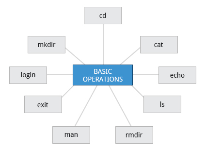

# Command Line Operations

## Introduction to the Command Line

Linux system administrators spend a significant amount of their time at a command line prompt. They often automate and troubleshoot tasks in this text environment. There is a saying, "graphical user interfaces make easy tasks easier, while command line interfaces make difficult tasks possible". Linux relies heavily on the abundance of command line tools. The command line interface provides the following advantages:

            * No GUI overhead is incurred.
            * Virtually any and every task can be accomplished while sitting at the command line.
            * You can implement scripts for often-used (or easy-to-forget) tasks and series of procedures.
            * You can sign into remote machines anywhere on the Internet.
            * You can initiate graphical applications directly from the command line instead of hunting through menus.
            * While graphical tools may vary among Linux distributions, the command line interface does not.

## Some Basic Utilities

            * cat: used to type out a file (or combine files)
            * head: used to show the first few lines of a file
            * tail: used to show the last few lines of a file
            * man: used to view documentation.
## Sudo
All the demonstrations created have a user configured with sudo capabilities to provide the user with administrative (admin) privileges when required. sudo allows users to run programs using the security privileges of another user, generally root (superuser). 

## Turning Off the Graphical Desktop
Linux distributions can start and stop the graphical desktop in various ways. The exact method differs from distribution and among distribution versions. For the newer systemd-based distributions, the display manager is run as a service, you can stop the GUI desktop with the systemctl utility and most distributions will also work with the telinit command, as in:

`$ sudo systemctl stop gdm (or sudo telinit 3)`

and restart it (after logging into the console) with:

`$ sudo systemctl start gdm (or sudo telinit 5)`

On Ubuntu versions before 18.04 LTS, substitute `lightdm` for `gdm`.

## Basic Operations

## Logging In and Out

An available text terminal will prompt for a username (with the string login:) and password. When typing your password, nothing is displayed on the terminal (not even a * to indicate that you typed in something), to prevent others from seeing your password. After you have logged into the system, you can perform basic operations.

Once your session is started (either by logging into a text terminal or via a graphical terminal program), you can also connect and log into remote systems by using Secure SHell (SSH).  For example, by typing ssh student@remote-server.com, SSH would connect securely to the remote machine (remote-server.com) and give student a command line terminal window, using either a password (as with regular logins) or cryptographic key to sign in without providing a password to verify the identity.

## Rebooting and Shutting Down
The halt and poweroff commands issue shutdown -h to halt the system; reboot issues shutdown -r and causes the machine to reboot instead of just shutting down. Both rebooting and shutting down from the command line requires superuser (root) access.

When administering a multi-user system, you have the option of notifying all users prior to shutdown, as in: `$ sudo shutdown -h 10:00 "Shutting down for scheduled maintenance."`

## Locating Applications
One way to locate programs is to employ the which utility. For example, to find out exactly where the diff program resides on the filesystem:
`$ which diff`
/usr/bin/diff

If which does not find the program, whereis is a good alternative because it looks for packages in a broader range of system directories:
`$ whereis diff`
diff: /usr/bin/diff /usr/share/man/man1/diff.1.gz /usr/share/man/man1p/diff.1p.gz

as well as locating source and man files packaged with the program.

## Accessing Directories

| Command        | Result           | 
| pwd      | Displays the present working directory| 
| cd ~ or cd      | Change to your home directory (shortcut name is ~ (tilde))      | 
| cd .. | Change to parent directory (..)     | 
| cd - | Change to previous directory (- (minus))     | 