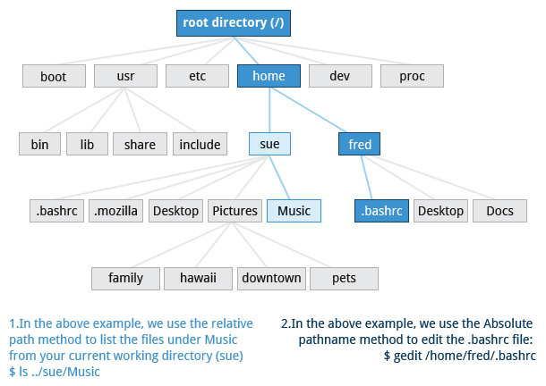
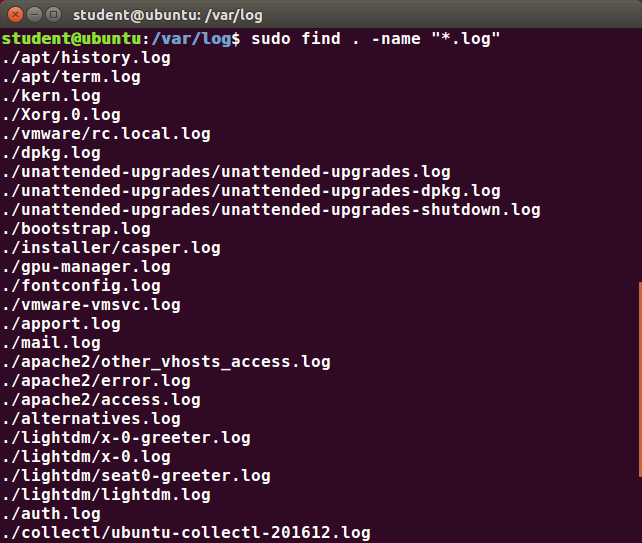

# Command Line Operations

## Introduction to the Command Line

Linux system administrators spend a significant amount of their time at a command line prompt. They often automate and troubleshoot tasks in this text environment. There is a saying, "graphical user interfaces make easy tasks easier, while command line interfaces make difficult tasks possible". Linux relies heavily on the abundance of command line tools. The command line interface provides the following advantages:

            * No GUI overhead is incurred.
            * Virtually any and every task can be accomplished while sitting at the command line.
            * You can implement scripts for often-used (or easy-to-forget) tasks and series of procedures.
            * You can sign into remote machines anywhere on the Internet.
            * You can initiate graphical applications directly from the command line instead of hunting through menus.
            * While graphical tools may vary among Linux distributions, the command line interface does not.

## Some Basic Utilities

            * cat: used to type out a file (or combine files)
            * head: used to show the first few lines of a file
            * tail: used to show the last few lines of a file
            * man: used to view documentation.
## Sudo
All the demonstrations created have a user configured with sudo capabilities to provide the user with administrative (admin) privileges when required. sudo allows users to run programs using the security privileges of another user, generally root (superuser). 

## Turning Off the Graphical Desktop
Linux distributions can start and stop the graphical desktop in various ways. The exact method differs from distribution and among distribution versions. For the newer systemd-based distributions, the display manager is run as a service, you can stop the GUI desktop with the systemctl utility and most distributions will also work with the telinit command, as in:

`$ sudo systemctl stop gdm (or sudo telinit 3)`

and restart it (after logging into the console) with:

`$ sudo systemctl start gdm (or sudo telinit 5)`

On Ubuntu versions before 18.04 LTS, substitute `lightdm` for `gdm`.

## Basic Operations

## Logging In and Out

An available text terminal will prompt for a username (with the string login:) and password. When typing your password, nothing is displayed on the terminal (not even a * to indicate that you typed in something), to prevent others from seeing your password. After you have logged into the system, you can perform basic operations.

Once your session is started (either by logging into a text terminal or via a graphical terminal program), you can also connect and log into remote systems by using Secure SHell (SSH).  For example, by typing ssh student@remote-server.com, SSH would connect securely to the remote machine (remote-server.com) and give student a command line terminal window, using either a password (as with regular logins) or cryptographic key to sign in without providing a password to verify the identity.

## Rebooting and Shutting Down
The halt and poweroff commands issue shutdown -h to halt the system; reboot issues shutdown -r and causes the machine to reboot instead of just shutting down. Both rebooting and shutting down from the command line requires superuser (root) access.

When administering a multi-user system, you have the option of notifying all users prior to shutdown, as in: `$ sudo shutdown -h 10:00 "Shutting down for scheduled maintenance."`

## Locating Applications
One way to locate programs is to employ the which utility. For example, to find out exactly where the diff program resides on the filesystem:
`$ which diff`
/usr/bin/diff

If which does not find the program, whereis is a good alternative because it looks for packages in a broader range of system directories:
`$ whereis diff`
diff: /usr/bin/diff /usr/share/man/man1/diff.1.gz /usr/share/man/man1p/diff.1p.gz

as well as locating source and man files packaged with the program.

## Accessing Directories

## Absolute and Relative Paths

## Exploring the Filesystem
Traversing up and down the filesystem tree can get tedious. The tree command is a good way to get a bird’s-eye view of the filesystem tree. Use tree -d to view just the directories and to suppress listing file names.

## Navigating the Directory History
The cd command remembers where you were last, and lets you get back there with cd -. For remembering more than just the last directory visited, use pushd to change the directory instead of cd; this pushes your starting directory onto a list. Using popd will then send you back to those directories, walking in reverse order (the most recent directory will be the first one retrieved with popd). The list of directories is displayed with the dirs command.

## Viewing Files

## touch
touch is often used to set or update the access, change, and modify times of files. By default, it resets a file's timestamp to match the current time.

However, you can also create an empty file using touch:

`$ touch <filename>`

This is normally done to create an empty file as a placeholder for a later purpose.

touch provides several useful options. For example, the -t option allows you to set the date and timestamp of the file to a specific value, as in:

`$ touch -t 12091600 myfile`

This sets the myfile file's timestamp to 4 p.m., December 9th (12 09 1600).

## mkdir and rmdir

mkdir is used to create a directory:

            * mkdir sampdir 
            It creates a sample directory named sampdir under the current directory. 
            * mkdir /usr/sampdir 
            It creates a sample directory called sampdir under /usr.

Removing a directory is done with rmdir. The directory must be empty or the command will fail. To remove a directory and all of its contents you have to do rm -rf.

## Moving, Renaming or Removing a File

## Renaming or Removing a Directory
rmdir works only on empty directories; otherwise you get an error. 

While typing rm –rf is a fast and easy way to remove a whole filesystem tree recursively, it is extremely dangerous and should be used with the utmost care, especially when used by root (recall that recursive means drilling down through all sub-directories, all the way down a tree).

## Pipes

The UNIX/Linux philosophy is to have many simple and short programs (or commands) cooperate together to produce quite complex results, rather than have one complex program with many possible options and modes of operation. In order to accomplish this, extensive use of pipes is made. You can pipe the output of one command or program into another as its input.

In order to do this, we use the vertical-bar, |, (pipe symbol) between commands as in:
 `$ command1 | command2 | command3`
The above represents what we often call a pipeline, and allows Linux to combine the actions of several commands into one. This is extraordinarily efficient because command2 and command3 do not have to wait for the previous pipeline commands to complete before they can begin hacking at the data in their input streams; on multiple CPU or core systems, the available computing power is much better utilized and things get done quicker.

## Searching for Files
The main tools for doing this are the locate and find utilities. We will also show how to use wildcards in bash, in order to specify any file which matches a given generalized request.

### locate
The locate utility program performs a search taking advantage of a previously constructed database of files and directories on your system, matching all entries that contain a specified character string. This can sometimes result in a very long list.

To get a shorter (and possibly more relevant) list, we can use the grep program as a filter. grep will print only the lines that contain one or more specified strings, as in: 
 `$ locate zip | grep bin`
which will list all the files and directories with both zip and bin in their name. We will cover grep in much more detail later. Notice the use of | to pipe the two commands together.

### Wildcards and Matching File Names

To search for files using the ? wildcard, replace each unknown character with ?. For example, if you know only the first two letters are 'ba' of a three-letter filename with an extension of .out, type ls ba?.out .

To search for files using the * wildcard, replace the unknown string with *. For example, if you remember only that the extension was .out, type ls *.out.

### The find Program
ind is an extremely useful and often-used utility program in the daily life of a Linux system administrator. It recurses down the filesystem tree from any particular directory (or set of directories) and locates files that match specified conditions. The default pathname is always the present working directory.

For example, administrators sometimes scan for potentially large core files (which contain diagnostic information after a program fails) that are more than several weeks old in order to remove them.

It is also common to remove files in inessential or outdated files in /tmp (and other volatile directories, such as those containing cached files) that have not been accessed recently. Many Linux distributions use shell scripts that run periodically (through cron usually) to perform such house cleaning.

#### Using find
When no arguments are given, find lists all files in the current directory and all of its subdirectories. Commonly used options to shorten the list include -name (only list files with a certain pattern in their name), -iname (also ignore the case of file names), and -type (which will restrict the results to files of a certain specified type, such as d for directory, l for symbolic link, or f for a regular file, etc.). 

Searching for files and directories named gcc:

`$ find /usr -name gcc`

Searching only for directories named gcc:

`$ find /usr -type d -name gcc`

Searching only for regular files named gcc:

`$ find /usr -type f -name gcc`

#### Using Advanced find Options

Another good use of find is being able to run commands on the files that match your search criteria. The -exec option is used for this purpose.

To find and remove all files that end with .swp: 

$ find -name "*.swp" -exec rm {} ’;’

The {} (squiggly brackets) is a placeholder that will be filled with all the file names that result from the find expression, and the preceding command will be run on each one individually.

Please note that you have to end the command with either ‘;’ (including the single-quotes) or "\;". Both forms are fine.

One can also use the -ok option, which behaves the same as -exec, except that find will prompt you for permission before executing the command. This makes it a good way to test your results before blindly executing any potentially dangerous commands.

#### Finding Files Based on Time and Size
t is sometimes the case that you wish to find files according to attributes, such as when they were created, last used, etc., or based on their size. It is easy to perform such searches.

To find files based on time:

`$ find / -ctime 3`

Here, -ctime is when the inode metadata (i.e. file ownership, permissions, etc.) last changed; it is often, but not necessarily, when the file was first created. You can also search for accessed/last read (-atime) or modified/last written (-mtime) times. The number is the number of days and can be expressed as either a number (n) that means exactly that value, +n, which means greater than that number, or -n, which means less than that number. There are similar options for times in minutes (as in -cmin, -amin, and -mmin).

To find files based on sizes:

`$ find / -size 0`

Note the size here is in 512-byte blocks, by default; you can also specify bytes (c), kilobytes (k), megabytes (M), gigabytes (G), etc. As with the time numbers above, file sizes can also be exact numbers (n), +n or -n. For details, consult the man page for find.

For example, to find files greater than 10 MB in size and running a command on those files:

`$ find / -size +10M -exec command {} ’;’`

## Package Management Systems on Linux
The core parts of a Linux distribution and most of its add-on software are installed via the Package Management System. Each package contains the files and other instructions needed to make one software component work well and cooperate with the other components that comprise the entire system. Packages can depend on each other. For example, a package for a web-based application written in PHP can depend on the PHP package.

There are two broad families of package managers: those based on Debian and those which use RPM as their low-level package manager. The two systems are incompatible, but broadly speaking, provide the same features and satisfy the same needs. There are some other systems used by more specialized Linux distributions.

### Package Managers: Two Levels
Both package management systems operate on two distinct levels: a low-level tool (such as dpkg or rpm) takes care of the details of unpacking individual packages, running scripts, getting the software installed correctly, while a high-level tool (such as apt, yum, dnf or zypper) works with groups of packages, downloads packages from the vendor, and figures out dependencies.

### Working With Different Package Management Systems
The Advanced Packaging Tool (apt) is the underlying package management system that manages software on Debian-based systems. While it forms the backend for graphical package managers, such as the Ubuntu Software Center and synaptic, its native user interface is at the command line, with programs that include apt (or apt-get) and apt-cache.

yum is an open source command-line package-management utility for the RPM-compatible Linux systems that belongs to the Red Hat family. yum has both command line and graphical user interfaces. Fedora and RHEL 8 have replaced yum with dnf, which has less historical baggage, has nice new capabilities and is mostly backwards-compatible with yum for day-to-day commands.

zypper is the package management system for the SUSE/openSUSE family and is also based on RPM. zypper also allows you to manage repositories from the command line. zypper is fairly straightforward to use and resembles yum quite closely.

