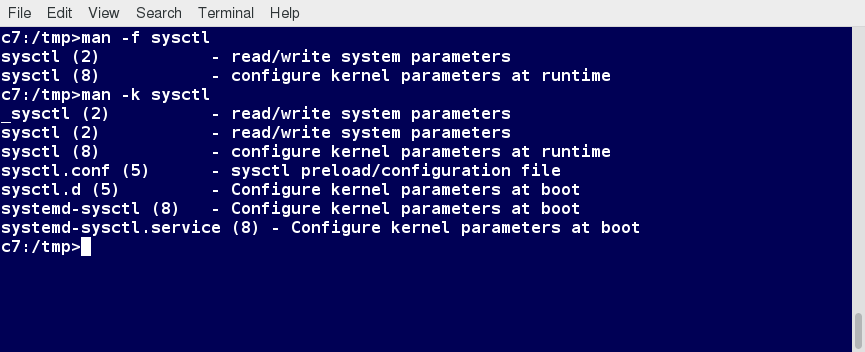
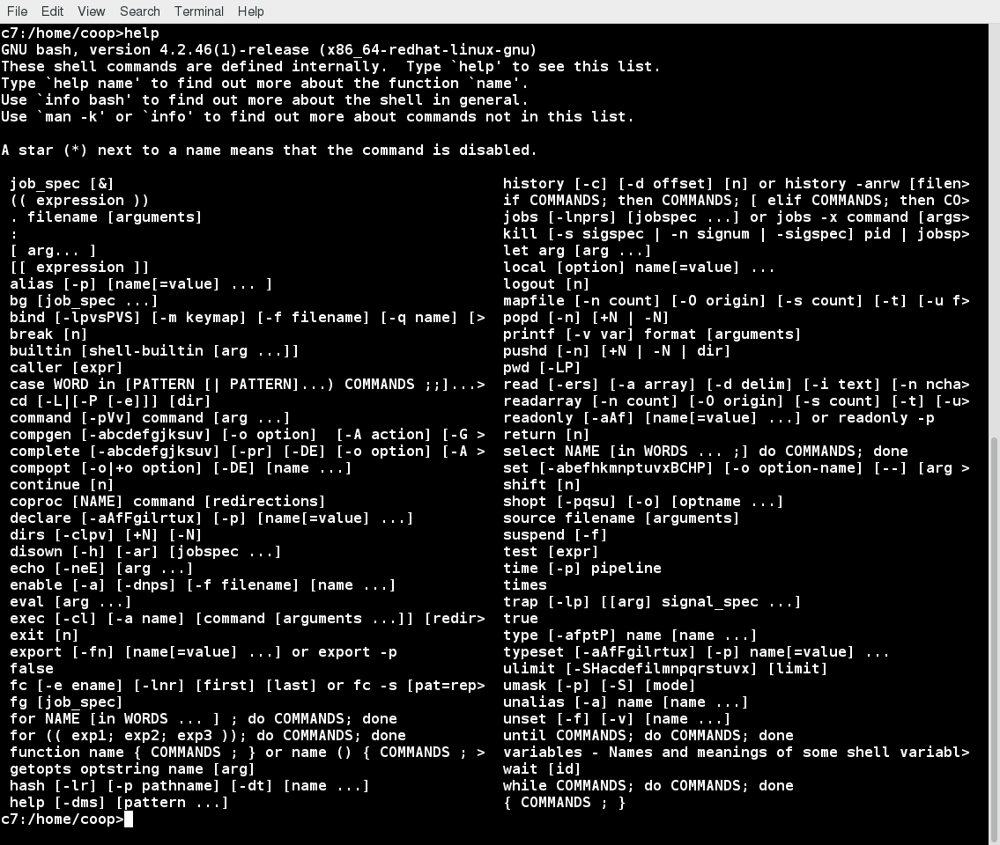
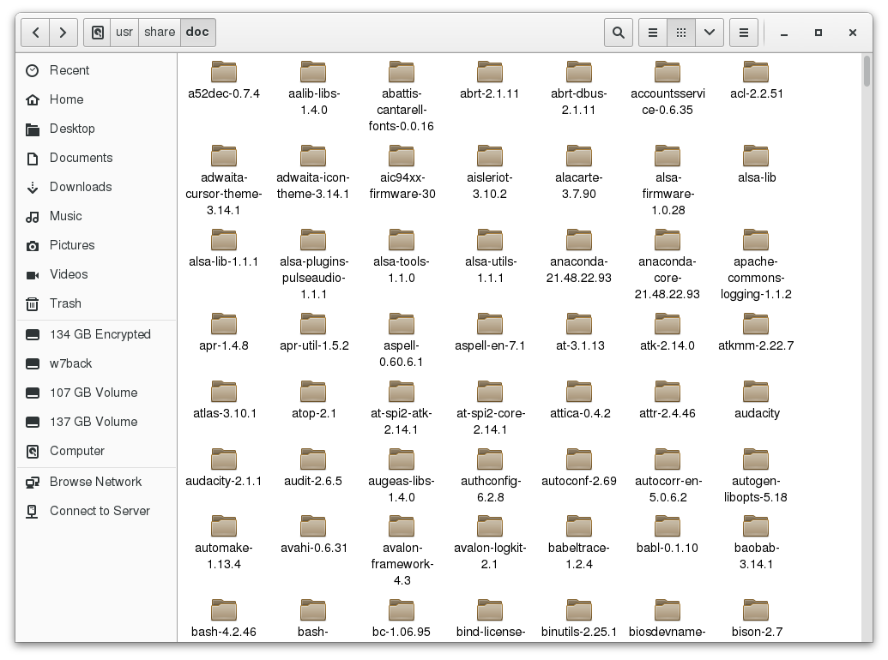

# Linux Documentation Sources

Whether you are an inexperienced user or a veteran, you will not always know (or remember) the proper use of various Linux programs and utilities: what is the command to type, what options does it take, etc. You will need to consult help documentation regularly. Because Linux-based systems draw from a large variety of sources, there are numerous reservoirs of documentation and ways of getting help. Distributors consolidate this material and present it in a comprehensive and easy-to-use manner.

Important Linux documentation sources include:

            The man pages (short for manual pages)
            GNU Info
            The help command and --help option
            Other documentation sources, e.g. Gentoo Handbook or Ubuntu Documentation.

## The man pages
The man pages are the most often-used source of Linux documentation. They provide in-depth documentation about many programs and utilities, as well as other topics, including configuration files, and programming APIs for system calls, library routines, and the kernel. They are present on all Linux distributions and are always at your fingertips.

The man pages infrastructure was first introduced in the early UNIX versions, at the beginning of 1970s. The name man is just an abbreviation for manual.

Typing man with a topic name as an argument retrieves the information stored in the topic's man pages.

### man

The man program searches, formats, and displays the information contained in the man page system. Because many topics have copious amount of relevant information, output is piped through a pager program (such as less) to be viewed one page at a time. At the same time, the information is formatted for a good visual display.

A given topic may have multiple pages associated with it and there is a default order determining which one is displayed when no options or section number is specified. To list all pages on the topic, use -f option. To list all pages that discuss a specified topic (even if the specified subject is not present in the name), use the –k option.

man –f generates the same result as typing whatis.

man –k generates the same result as typing apropos.

The default order is specified in /etc/man_db.conf and is roughly (but not exactly) in ascending numerical order by section.

### Manual Chapters
The man pages are divided into chapters numbered 1 through 9. In some cases, a letter is appended to the chapter number to identify a specific topic. For example, many pages describing part of the X Window API are in chapter 3X.

The chapter number can be used to force man to display the page from a particular chapter. It is common to have multiple pages across multiple chapters with the same name, especially for names of library functions or system calls.

With the -a parameter, man will display all pages with the given name in all chapters, one after the other, as in:

`$ man -a socket`

## The GNU Info System
This is the GNU project's standard documentation format, which it prefers as an alternative to man. The Info System is basically free-form, and supports linked subsections.

Functionally, info resembles man in many ways. However, topics are connected using links (even though its design predates the World Wide Web). Information can be viewed through either a command line interface, a graphical help utility, printed or viewed online

### Using info from the Command Line
yping info with no arguments in a terminal window displays an index of available topics. You can browse through the topic list using the regular movement keys: arrows, Page Up, and Page Down.

You can view help for a particular topic by typing info <topic name>. The  system then searches for the topic in all available info files.

Some useful keys are: q to quit, h for help, and Enter to select a menu item.

### info Page Structure
The topic which you view in an info page is called a node. The table lists the basic keystrokes for moving between nodes.

Nodes are essentially sections and subsections in the documentation. You can move between nodes or view each node sequentially. Each node may contain menus and linked subtopics, or items.

Items function like browser links and are identified by an asterisk (*) at the beginning of the item name. Named items (outside a menu) are identified with double-colons (::) at the end of the item name. Items can refer to other nodes within the file or to other files. 
key = function
n = Go to the next node
p = Go to the previous node
u = Move one node up in the index

## The --help Option
Another important source of Linux documentation is use of the --help option.

Most commands have an available short description which can be viewed using the --help or the -h option along with the command or application. For example, to learn more about the man command, you can type: 

`$ man --help`

The --help option is useful as a quick reference and it displays information faster than the man or info pages.

## The help Command
To view a synopsis of these built-in commands, you can simply type help as shown in the screenshot.

For these built-in commands, help performs the same basic function as the -h and --help arguments perform for standalone programs.

### Package Documentation
Linux documentation is also available as part of the package management system. Usually, this documentation is directly pulled from the upstream source code, but it can also contain information about how the distribution packaged and set up the software.

Such information is placed under the /usr/share/doc directory, grouped in subdirectories named after each package, perhaps including the version number in the name.

### Online Resources
The following book has been well-reviewed by other users of this course. It is a free, downloadable command line compendium under a Creative Commons license:  ["The Linux Command Line"](http://linuxcommand.org/tlcl.php) by William Shotts.

[Ubuntu Documentation](https://help.ubuntu.com/)
[CentoS Documentation](https://wiki.centos.org/Documentation)
[Fedora Documentation.](https://docs.fedoraproject.org/en-US/docs/)
