# What Is a Process?

A process is simply an instance of one or more related tasks (threads) executing on your computer. It is not the same as a program or a command. A single command may actually start several processes simultaneously. Some processes are independent of each other and others are related. A failure of one process may or may not affect the others running on the system.

Processes use many system resources, such as memory, CPU (central processing unit) cycles, and peripheral devices, such as network cards, hard drives, printers and displays. The operating system (especially the kernel) is responsible for allocating a proper share of these resources to each process and ensuring overall optimized system utilization.
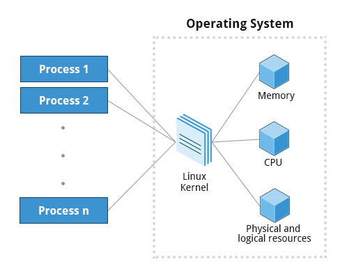

## Process Types

A terminal window (one kind of command shell) is a process that runs as long as needed. It allows users to execute programs and access resources in an interactive environment. You can also run programs in the background, which means they become detached from the shell.

Processes can be of different types according to the task being performed. Here are some different process types, along with their descriptions and examples:

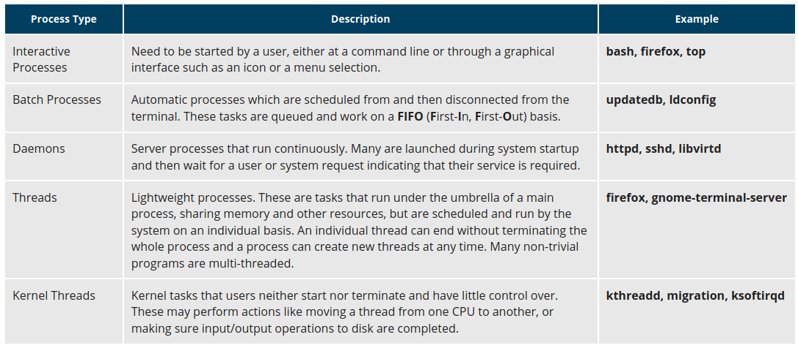

## Process Scheduling and States

A critical kernel function called the scheduler constantly shifts processes on and off the CPU, sharing time according to relative priority, how much time is needed and how much has already been granted to a task.

When a process is in a so-called running state, it means it is either currently executing instructions on a CPU, or is waiting to be granted a share of time (a time slice) so it can execute. All processes in this state reside on what is called a run queue and on a computer with multiple CPUs, or cores, there is a run queue on each.

However, sometimes processes go into what is called a sleep state, generally when they are waiting for something to happen before they can resume, perhaps for the user to type something. In this condition, a process is said to be sitting on a wait queue.

There are some other less frequent process states, especially when a process is terminating. Sometimes, a child process completes, but its parent process has not asked about its state. Amusingly, such a process is said to be in a zombie state; it is not really alive, but still shows up in the system's list of processes.
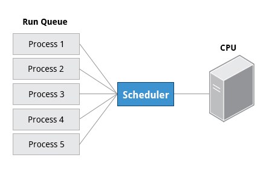

## Process and Thread IDs
At any given time, there are always multiple processes being executed. The operating system keeps track of them by assigning each a unique process ID (PID) number. The PID is used to track process state, CPU usage, memory use, precisely where resources are located in memory, and other characteristics.

New PIDs are usually assigned in ascending order as processes are born. Thus, PID 1 denotes the init process (initialization process), and succeeding processes are gradually assigned higher numbers.

The table explains the PID types and their descriptions:
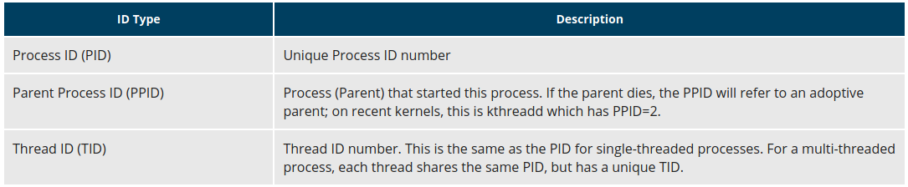

## Terminating a Process

At some point, one of your applications may stop working properly. How do you eliminate it?

To terminate a process, you can type kill -SIGKILL <pid> or kill -9 <pid>.

Note, however, you can only kill your own processes; those belonging to another user are off limits, unless you are root.

## User and Group IDs

Many users can access a system simultaneously, and each user can run multiple processes. The operating system identifies the user who starts the process by the Real User ID (RUID) assigned to the user.

The user who determines the access rights for the users is identified by the Effective UID (EUID). The EUID may or may not be the same as the RUID.

Users can be categorized into various groups. Each group is identified by the Real Group ID (RGID). The access rights of the group are determined by the Effective Group ID (EGID). Each user can be a member of one or more groups.

Most of the time we ignore these details and just talk about the User ID (UID) and Group ID (GID).
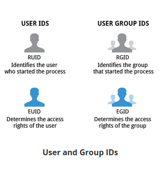

### Load Averages
The load average is the average of the load number for a given period of time. It takes into account processes that are:

            Actively running on a CPU
            Considered runnable, but waiting for a CPU to become available
            Sleeping: i.e. waiting for some kind of resource (typically, I/O) to become available.

Note: Linux differs from other UNIX-like operating systems in that it includes the sleeping processes. Furthermore, it only includes so-called uninterruptible sleepers, those which cannot be awakened easily.

The load average can be viewed by running w, top or uptime. We will explain the numbers on the next page.

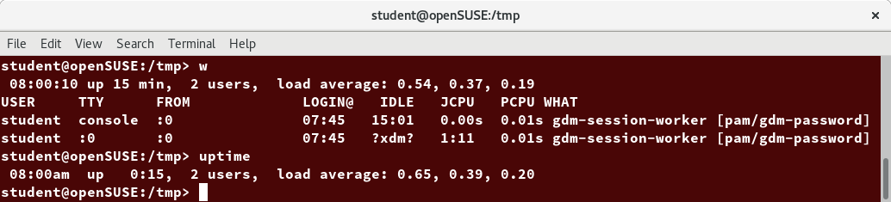

### Interpreting Load Averages
The load average is displayed using three numbers (0.45, 0.17, and 0.12) in the below screenshot. Assuming our system is a single-CPU system, the three load average numbers are interpreted as follows:

            0.45: For the last minute the system has been 45% utilized on average.
            0.17: For the last 5 minutes utilization has been 17%.
            0.12: For the last 15 minutes utilization has been 12%.

If we saw a value of 1.00 in the second position, that would imply that the single-CPU system was 100% utilized, on average, over the past 5 minutes; this is good if we want to fully use a system. A value over 1.00 for a single-CPU system implies that the system was over-utilized: there were more processes needing CPU than CPU was available.

### Background and Foreground Processes
Linux supports background and foreground job processing. A job in this context is just a command launched from a terminal window. Foreground jobs run directly from the shell, and when one foreground job is running, other jobs need to wait for shell access (at least in that terminal window if using the GUI) until it is completed. This is fine when jobs complete quickly. But this can have an adverse effect if the current job is going to take a long time (even several hours) to complete.

In such cases, you can run the job in the background and free the shell for other tasks. The background job will be executed at lower priority, which, in turn, will allow smooth execution of the interactive tasks, and you can type other commands in the terminal window while the background job is running. By default, all jobs are executed in the foreground. You can put a job in the background by suffixing & to the command, for example: updatedb &.

You can either use CTRL-Z to suspend a foreground job or CTRL-C to terminate a foreground job and can always use the bg and fg commands to run a process in the background and foreground, respectively.

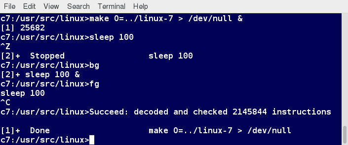

### Managing Jobs
The jobs utility displays all jobs running in background. The display shows the job ID, state, and command name, as shown here.

jobs -l provides the same information as jobs, and adds the PID of the background jobs.

The background jobs are connected to the terminal window, so, if you log off, the jobs utility will not show the ones started from that window.

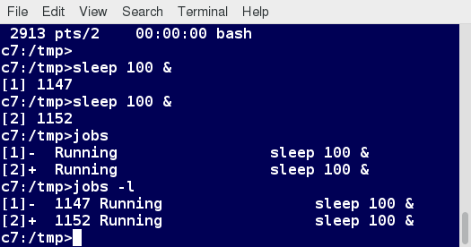

### Getting Uptime and Load Averages
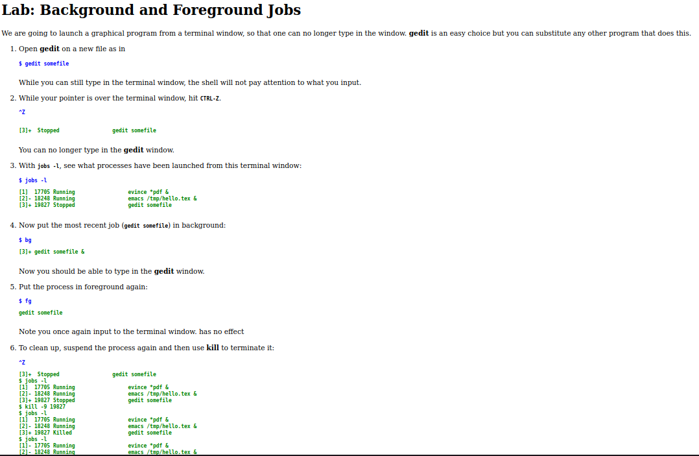

### The ps Command (System V Style)
ps provides information about currently running processes keyed by PID. If you want a repetitive update of this status, you can use top or other commonly installed variants (such as htop or atop) from the command line, or invoke your distribution's graphical system monitor application.

ps has many options for specifying exactly which tasks to examine, what information to display about them, and precisely what output format should be used.

Without options, ps will display all processes running under the current shell. You can use the -u option to display information of processes for a specified username. The command ps -ef displays all the processes in the system in full detail. The command ps -eLf goes one step further and displays one line of information for every thread (remember, a process can contain multiple threads).

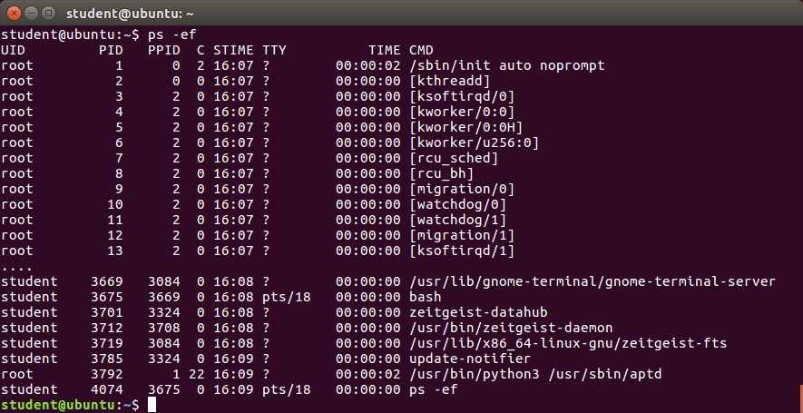

### The ps Command (BSD Style)
ps has another style of option specification, which stems from the BSD variety of UNIX, where options are specified without preceding dashes. For example, the command ps aux displays all processes of all users. The command ps axo allows you to specify which attributes you want to view.

The screenshot shows a sample output of ps with the aux and axo qualifiers.

### The Process Tree
pstree displays the processes running on the system in the form of a tree diagram showing the relationship between a process and its parent process and any other processes that it created. Repeated entries of a process are not displayed, and threads are displayed in curly braces.

### top
While a static view of what the system is doing is useful, monitoring the system performance live over time is also valuable. One option would be to run ps at regular intervals, say, every few seconds. A better alternative is to use top to get constant real-time updates (every two seconds by default), until you exit by typing q. top clearly highlights which processes are consuming the most CPU cycles and memory (using appropriate commands from within top).
#### First Line of the top Output
The first line of the top output displays a quick summary of what is happening in the system, including:

            How long the system has been up
            How many users are logged on
            What is the load average

The load average determines how busy the system is. A load average of 1.00 per CPU indicates a fully subscribed, but not overloaded, system. If the load average goes above this value, it indicates that processes are competing for CPU time. If the load average is very high, it might indicate that the system is having a problem, such as a runaway process (a process in a non-responding state).
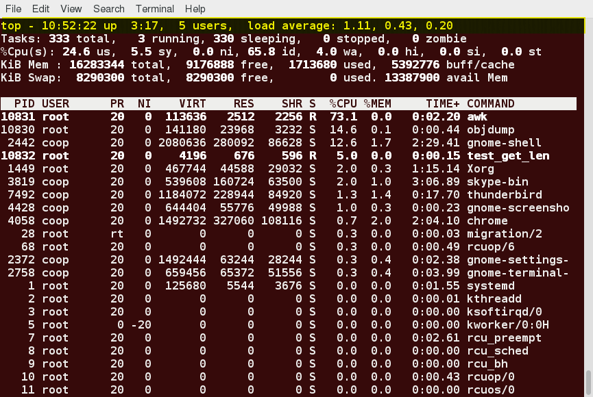

#### Second Line of the top Output
The second line of the top output displays the total number of processes, the number of running, sleeping, stopped, and zombie processes. Comparing the number of running processes with the load average helps determine if the system has reached its capacity or perhaps a particular user is running too many processes. The stopped processes should be examined to see if everything is running correctly.

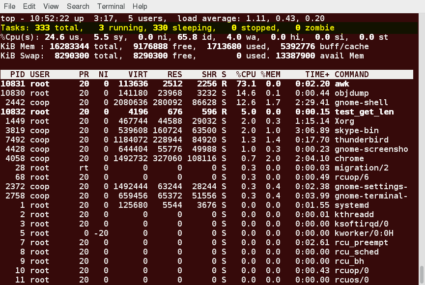

#### Third Line of the top Output
The third line of the top output indicates how the CPU time is being divided between the users (us) and the kernel (sy) by displaying the percentage of CPU time used for each.

The percentage of user jobs running at a lower priority (niceness - ni) is then listed. Idle mode (id) should be low if the load average is high, and vice versa. The percentage of jobs waiting (wa) for I/O is listed. Interrupts include the percentage of hardware (hi) vs. software interrupts (si). Steal time (st) is generally used with virtual machines, which has some of its idle CPU time taken for other uses.
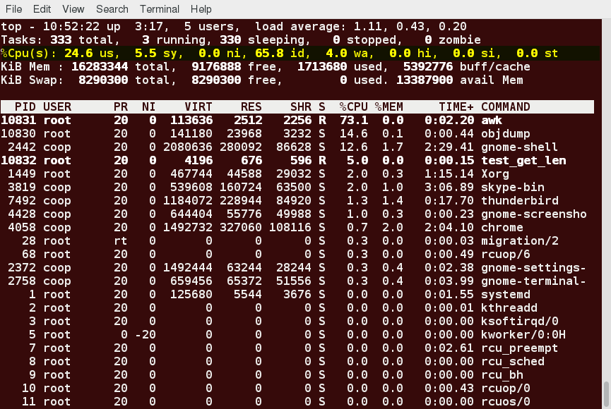

#### Fourth and Fifth Lines of the top Output
The fourth and fifth lines of the top output indicate memory usage, which is divided in two categories:

            Physical memory (RAM) – displayed on line 4.
            Swap space – displayed on line 5.

Both categories display total memory, used memory, and free space.

You need to monitor memory usage very carefully to ensure good system performance. Once the physical memory is exhausted, the system starts using swap space (temporary storage space on the hard drive) as an extended memory pool, and since accessing disk is much slower than accessing memory, this will negatively affect system performance.

If the system starts using swap often, you can add more swap space. However, adding more physical memory should also be consider
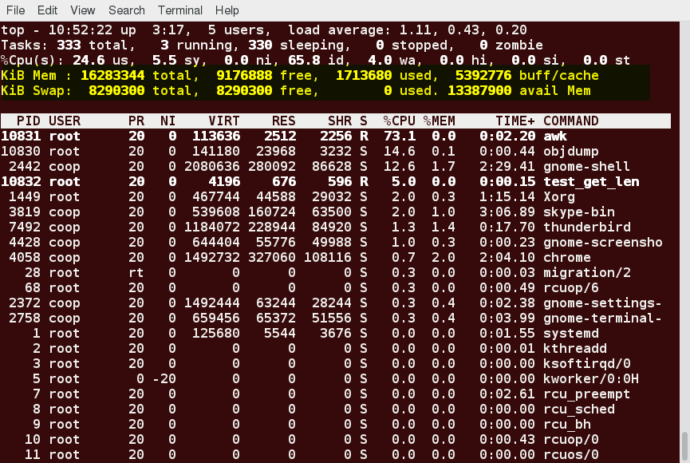

#### Process List of the top Output
Each line in the process list of the top output displays information about a process. By default, processes are ordered by highest CPU usage. The following information about each process is displayed:

            * Process Identification Number (PID)
            * Process owner (USER)
            * Priority (PR) and nice values (NI)
            * Virtual (VIRT), physical (RES), and shared memory (SHR)
            * Status (S)
            * Percentage of CPU (%CPU) and memory (%MEM) used
            * Execution time (TIME+)
            * Command (COMMAND).

### Interactive Keys with top
Besides reporting information, top can be utilized interactively for monitoring and controlling processes. While top is running in a terminal window, you can enter single-letter commands to change its behavior. For example, you can view the top-ranked processes based on CPU or memory usage. If needed, you can alter the priorities of running processes or you can stop/kill a process.

The table lists what happens when pressing various keys when running top:
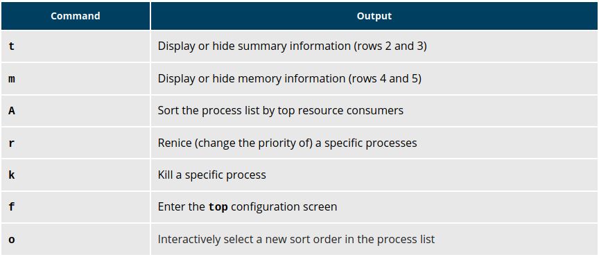

##  Starting Processes in the Future 
### Scheduling Future Processes Using at
Suppose you need to perform a task on a specific day sometime in the future. However, you know you will be away from the machine on that day. How will you perform the task? You can use the at utility program to execute any non-interactive command at a specified time, as illustrated in the diagram:
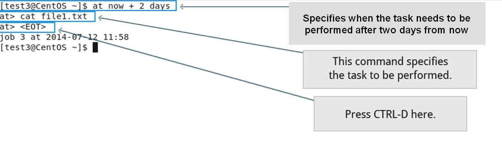

### cron

cron is a time-based scheduling utility program. It can launch routine background jobs at specific times and/or days on an on-going basis. cron is driven by a configuration file called /etc/crontab (cron table), which contains the various shell commands that need to be run at the properly scheduled times. There are both system-wide crontab files and individual user-based ones. Each line of a crontab file represents a job, and is composed of a so-called CRON expression, followed by a shell command to execute.

Typing crontab -e  will open the crontab editor to edit existing jobs or to create new jobs. Each line of the crontab file will contain 6 fields:
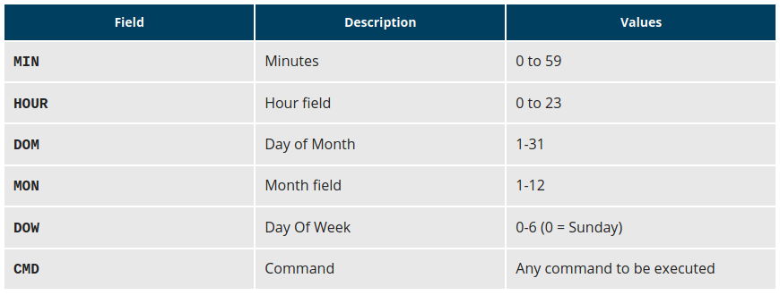

Examples:

            The entry * * * * * /usr/local/bin/execute/this/script.sh will schedule a job to execute script.sh every minute of every hour of every day of the month, and every month and every day in the week.
            The entry 30 08 10 06 * /home/sysadmin/full-backup will schedule a full-backup at 8.30 a.m., 10-June, irrespective of the day of the week.

### sleep
Sometimes, a command or job must be delayed or suspended. Suppose, for example, an application has read and processed the contents of a data file and then needs to save a report on a backup system. If the backup system is currently busy or not available, the application can be made to sleep (wait) until it can complete its work. Such a delay might be to mount the backup device and prepare it for writing.

sleep suspends execution for at least the specified period of time, which can be given as the number of seconds (the default), minutes, hours, or days. After that time has passed (or an interrupting signal has been received), execution will resume.

The syntax is:

sleep NUMBER[SUFFIX]...

where SUFFIX may be:

            s for seconds (the default)
            m for minutes
            h for hours
            d for days.

sleep and at are quite different; sleep delays execution for a specific period, while at starts execution at a later time.
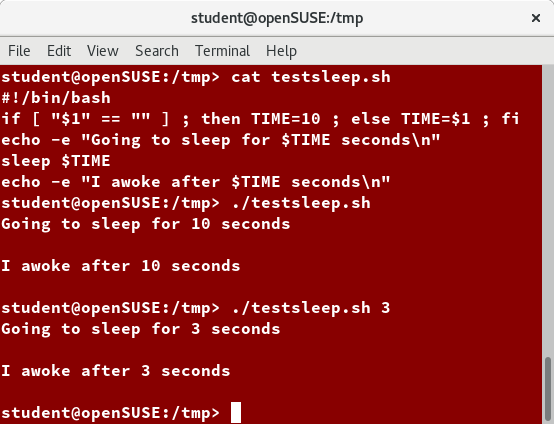

#### Lab: Using at for Batch Processing in the Future
Schedule a very simple task to run at a future time from now. This can be as simple as running ls or date and saving the output. You can use a time as short as one minute in the future.

Note that the command will run in the directory from which you schedule it with at.

Do this:

            From a short bash script.
            Interactively.
Solution:
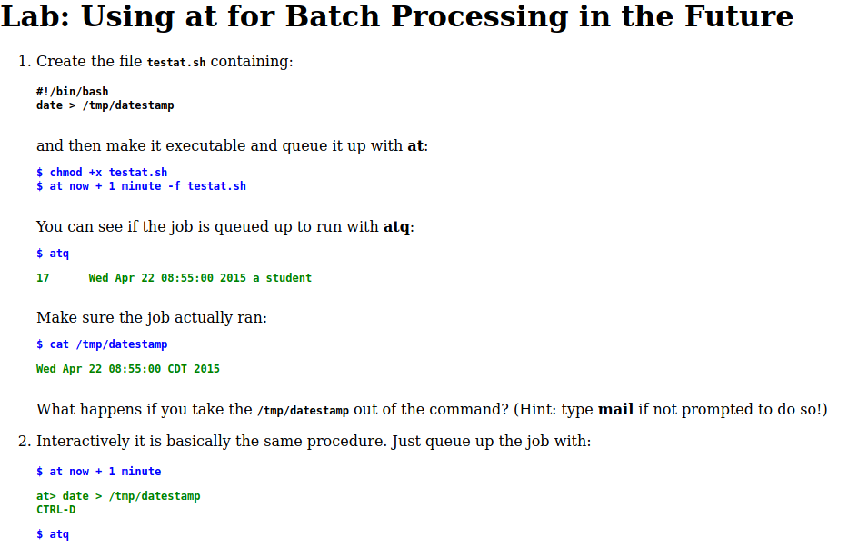

#### Lab: Scheduling a Periodic Task with cron
Set up a cron job to do some simple task every day at 10 a.m.
Solution:
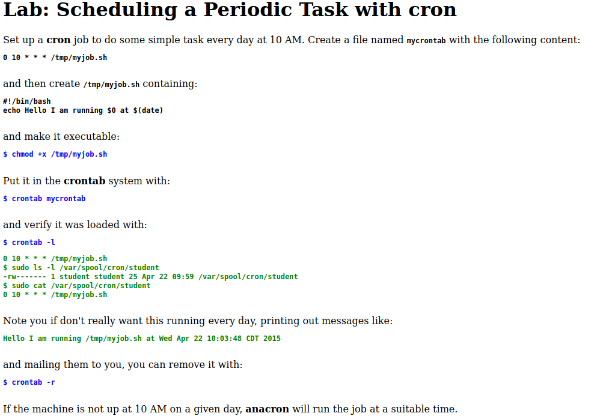

